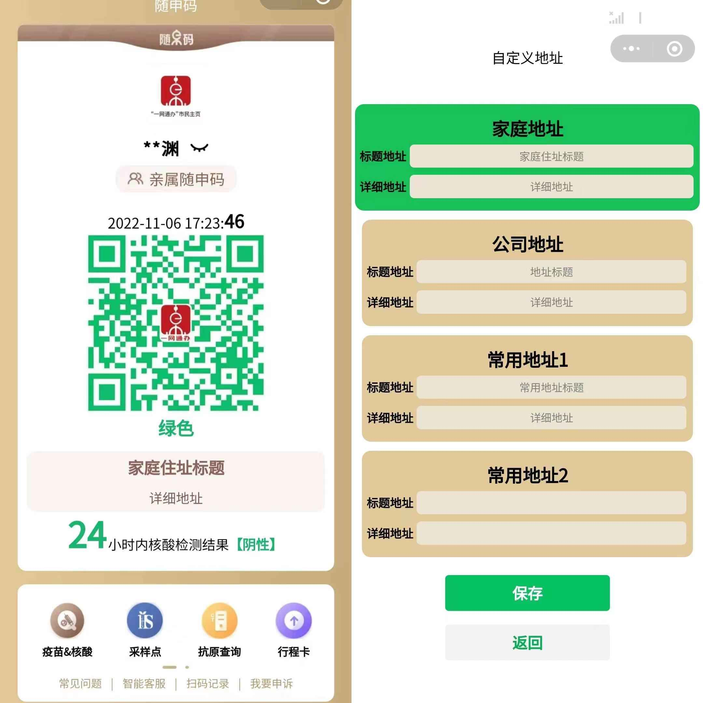

## 微信小程序：随申码

随申码是目前开发、优化较为成熟的一款小程序 app。
其在近两年的大规模测试中运行稳定，且在 UI 设计、并发性能、功能实现等方面可圈可点。
在各省份的健康码程序中也是独树一帜的一款产品。

本仓库代码仅供热爱小程序开发的小伙伴们参考交流，其中所包含的二维码、logo 以及个人信息都来自网络，如若用于非法用途，本人保留依法追责的权利。

# 小程序界面：

基础界面：

最多支持自定义 4 个地址：

**小程序可以缓存最近使用的地址信息，并在下一次打开时自动加载，无需重复输入地址。**

# 30 分钟内在自己的手机上复现:

由于众所周知的原因，小程序无法提交上线供大家学习，因此需要使用者**有一定的代码开发基础**，在本地编译小程序并上传到手机。

> 需要工具： 一台笔记本，一个手机

## A.准备工作：

- 使用本代码进行开发需要申请微信小程序 appid，小程序注册网址：https://mp.weixin.qq.com/wxopen/waregister?action=step1

  > 注意，由于本小程序仅仅用于`个人学习`用途，最终仅在本机保留开发版或体验版小程序，因此不需要提交至平台审核或者上线，因此无需担心小程序造成不良影响而被审查。

- 下载[微信小程序开发工具](https://developers.weixin.qq.com/miniprogram/dev/devtools/download.html)，这是一个微信官方推出的代码编辑器，界面和功能十分类似于 vscode。

## B.本地运行

1. 将代码包下载到本地，然后使用编辑器打开
   使用注册得到的 appid 替换`project.config.json`文件中的`appid: “xxxxx”`，点击编辑器界面上方的`编译`按钮，并打开编辑器左上方的`模拟器`以及`调试器`。顺利的话，此时应该可以在本地运行代码了。
2. 接着点击编辑器上方的预览，选择相应的设置，即可在手机上进行调试。
3. 点击编辑器界面右上角的上传按钮，然后在[小程序管理页面](https://mp.weixin.qq.com/)查看并管理您的小程序。再次声明，本代码只允许开发者在本人手机上调试使用，请不要提交审核您的小程序，更不要向他人传播，谢谢！
